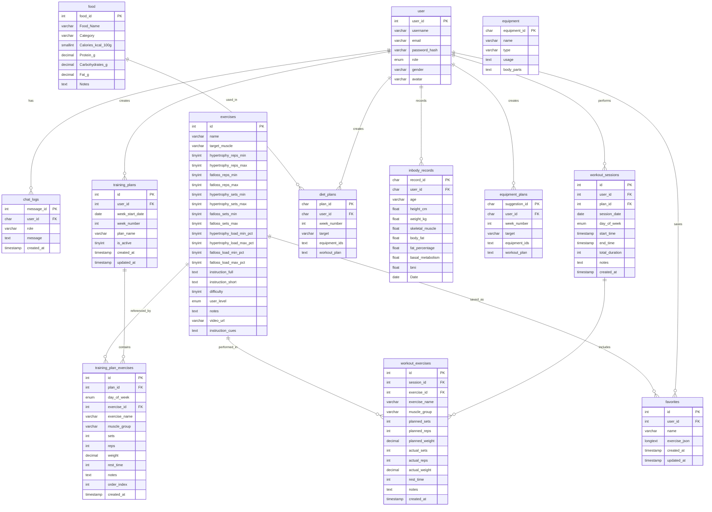

# 健習生系統資料庫結構文件

> 本文件描述「健習生」系統的完整資料庫結構，包含所有資料表、欄位定義與說明。

---

## 1. 使用者資料表 (user)

| 欄位名稱 | 資料型態 | 是否必填 | 預設值 | 說明 | 編碼與排序 |
|---------|---------|---------|--------|------|-----------|
| `user_id` | int(11) | ✓ | AUTO_INCREMENT | 使用者唯一識別碼 | - |
| `username` | varchar(50) | ✗ | NULL | 使用者名稱 | utf8mb4_unicode_ci |
| `email` | varchar(100) | ✗ | NULL | 登入用電子信箱 | utf8mb4_unicode_ci |
| `password_hash` | varchar(255) | ✗ | NULL | 加密後的密碼 | utf8mb4_unicode_ci |
| `role` | enum('user', 'admin', 'staff') | ✗ | NULL | 使用者角色 | utf8mb4_unicode_ci |
| `gender` | varchar(10) | ✗ | NULL | 性別 | utf8mb4_unicode_ci |
| `avatar` | varchar(255) | ✗ | NULL | 大頭貼檔案路徑 | utf8mb4_unicode_ci |

**索引：**
- PRIMARY KEY: `user_id`

---

## 2. 聊天記錄表 (chat_logs)

| 欄位名稱 | 資料型態 | 是否必填 | 預設值 | 說明 | 編碼與排序 |
|---------|---------|---------|--------|------|-----------|
| `message_id` | int(24) | ✓ | AUTO_INCREMENT | 訊息唯一識別碼 | - |
| `user_id` | char(24) | ✗ | NULL | 使用者 ID | utf8mb4_unicode_ci |
| `role` | varchar(20) | ✗ | NULL | 角色 (user, assistant) | utf8mb4_unicode_ci |
| `message` | text | ✗ | NULL | 訊息內容 | utf8mb4_unicode_ci |
| `created_at` | timestamp | ✓ | current_timestamp() | 建立時間 | - |

**索引：**
- PRIMARY KEY: `message_id`
- INDEX: `user_id`

---

## 3. 運動資料表 (exercises)

| 欄位名稱 | 資料型態 | 是否必填 | 預設值 | 說明 | 編碼與排序 |
|---------|---------|---------|--------|------|-----------|
| `id` | int(10) UNSIGNED | ✓ | AUTO_INCREMENT | 運動唯一識別碼 | - |
| `name` | varchar(100) | ✓ | - | 運動名稱 | utf8mb4_unicode_ci |
| `target_muscle` | varchar(20) | ✓ | - | 目標肌群 | utf8mb4_unicode_ci |
| `hypertrophy_reps_min` | tinyint(3) UNSIGNED | ✗ | NULL | 肌肥大最少次數 | - |
| `hypertrophy_reps_max` | tinyint(3) UNSIGNED | ✗ | NULL | 肌肥大最多次數 | - |
| `fatloss_reps_min` | tinyint(3) UNSIGNED | ✗ | NULL | 減脂最少次數 | - |
| `fatloss_reps_max` | tinyint(3) UNSIGNED | ✗ | NULL | 減脂最多次數 | - |
| `hypertrophy_sets_min` | tinyint(3) UNSIGNED | ✗ | NULL | 肌肥大最少組數 | - |
| `hypertrophy_sets_max` | tinyint(3) UNSIGNED | ✗ | NULL | 肌肥大最多組數 | - |
| `fatloss_sets_min` | tinyint(3) UNSIGNED | ✗ | NULL | 減脂最少組數 | - |
| `fatloss_sets_max` | tinyint(3) UNSIGNED | ✗ | NULL | 減脂最多組數 | - |
| `hypertrophy_load_min_pct` | tinyint(3) UNSIGNED | ✗ | NULL | 肌肥大最少負重百分比 | - |
| `hypertrophy_load_max_pct` | tinyint(3) UNSIGNED | ✗ | NULL | 肌肥大最多負重百分比 | - |
| `fatloss_load_min_pct` | tinyint(3) UNSIGNED | ✗ | NULL | 減脂最少負重百分比 | - |
| `fatloss_load_max_pct` | tinyint(3) UNSIGNED | ✗ | NULL | 減脂最多負重百分比 | - |
| `instruction_full` | text | ✗ | NULL | 完整動作說明 | utf8mb4_unicode_ci |
| `instruction_short` | text | ✗ | NULL | 簡短動作說明 | utf8mb4_unicode_ci |
| `difficulty` | tinyint(3) UNSIGNED | ✗ | NULL | 難度等級 (1-5) | - |
| `user_level` | enum('新手', '有基礎', '進階') | ✗ | NULL | 使用者等級 | utf8mb4_unicode_ci |
| `notes` | text | ✗ | NULL | 備註 | utf8mb4_unicode_ci |
| `video_url` | varchar(255) | ✗ | NULL | 教學影片連結 | utf8mb4_unicode_ci |
| `instruction_cues` | text | ✗ | NULL | 動作要領 | utf8mb4_unicode_ci |

**索引：**
- PRIMARY KEY: `id`
- INDEX: `target_muscle`
- INDEX: `difficulty`
- INDEX: `user_level`

---

## 4. 訓練計畫表 (training_plans)

| 欄位名稱 | 資料型態 | 是否必填 | 預設值 | 說明 | 編碼與排序 |
|---------|---------|---------|--------|------|-----------|
| `id` | int(11) | ✓ | AUTO_INCREMENT | 計畫唯一識別碼 | - |
| `user_id` | int(11) | ✓ | - | 使用者 ID (外鍵) | - |
| `week_start_date` | date | ✓ | - | 週開始日期 | - |
| `week_number` | int(11) | ✓ | - | 週數 | - |
| `plan_name` | varchar(255) | ✗ | '訓練計畫' | 計畫名稱 | utf8mb4_unicode_ci |
| `is_active` | tinyint(1) | ✗ | 1 | 是否啟用 | - |
| `created_at` | timestamp | ✓ | current_timestamp() | 建立時間 | - |
| `updated_at` | timestamp | ✓ | current_timestamp() ON UPDATE current_timestamp() | 最後更新時間 | - |

**索引：**
- PRIMARY KEY: `id`
- INDEX: `user_id`
- INDEX: `week_start_date`
- INDEX: `week_number`

---

## 5. 訓練計畫運動表 (training_plan_exercises)

| 欄位名稱 | 資料型態 | 是否必填 | 預設值 | 說明 | 編碼與排序 |
|---------|---------|---------|--------|------|-----------|
| `id` | int(11) | ✓ | AUTO_INCREMENT | 記錄唯一識別碼 | - |
| `plan_id` | int(11) | ✓ | - | 計畫 ID (外鍵) | - |
| `day_of_week` | enum('monday', 'tuesday', 'wednesday', 'thursday', 'friday', 'saturday', 'sunday') | ✓ | - | 星期幾 | utf8mb4_unicode_ci |
| `exercise_id` | int(11) | ✓ | - | 運動 ID (外鍵) | - |
| `exercise_name` | varchar(255) | ✓ | - | 運動名稱 | utf8mb4_unicode_ci |
| `muscle_group` | varchar(50) | ✓ | - | 肌群 | utf8mb4_unicode_ci |
| `sets` | int(11) | ✗ | 0 | 組數 | - |
| `reps` | int(11) | ✗ | 0 | 次數 | - |
| `weight` | decimal(5,2) | ✗ | NULL | 重量 | - |
| `rest_time` | int(11) | ✗ | NULL | 休息時間 (秒) | - |
| `notes` | text | ✗ | NULL | 備註 | utf8mb4_unicode_ci |
| `order_index` | int(11) | ✗ | 0 | 排序索引 | - |
| `created_at` | timestamp | ✓ | current_timestamp() | 建立時間 | - |

**索引：**
- PRIMARY KEY: `id`
- INDEX: `plan_id`
- INDEX: `day_of_week`
- INDEX: `exercise_id`

---

## 6. 運動記錄表 (workout_exercises)

| 欄位名稱 | 資料型態 | 是否必填 | 預設值 | 說明 | 編碼與排序 |
|---------|---------|---------|--------|------|-----------|
| `id` | int(11) | ✓ | AUTO_INCREMENT | 記錄唯一識別碼 | - |
| `session_id` | int(11) | ✓ | - | 訓練課程 ID (外鍵) | - |
| `exercise_id` | int(11) | ✓ | - | 運動 ID (外鍵) | - |
| `exercise_name` | varchar(255) | ✓ | - | 運動名稱 | utf8mb4_unicode_ci |
| `muscle_group` | varchar(50) | ✓ | - | 肌群 | utf8mb4_unicode_ci |
| `planned_sets` | int(11) | ✗ | 0 | 計畫組數 | - |
| `planned_reps` | int(11) | ✗ | 0 | 計畫次數 | - |
| `planned_weight` | decimal(5,2) | ✗ | NULL | 計畫重量 | - |
| `actual_sets` | int(11) | ✗ | 0 | 實際組數 | - |
| `actual_reps` | int(11) | ✗ | 0 | 實際次數 | - |
| `actual_weight` | decimal(5,2) | ✗ | NULL | 實際重量 | - |
| `rest_time` | int(11) | ✗ | NULL | 休息時間 (秒) | - |
| `notes` | text | ✗ | NULL | 備註 | utf8mb4_unicode_ci |
| `created_at` | timestamp | ✓ | current_timestamp() | 建立時間 | - |

**索引：**
- PRIMARY KEY: `id`
- INDEX: `session_id`
- INDEX: `exercise_id`

---

## 7. 訓練課程表 (workout_sessions)

| 欄位名稱 | 資料型態 | 是否必填 | 預設值 | 說明 | 編碼與排序 |
|---------|---------|---------|--------|------|-----------|
| `id` | int(11) | ✓ | AUTO_INCREMENT | 課程唯一識別碼 | - |
| `user_id` | int(11) | ✓ | - | 使用者 ID (外鍵) | - |
| `plan_id` | int(11) | ✓ | - | 計畫 ID (外鍵) | - |
| `session_date` | date | ✓ | - | 訓練日期 | - |
| `day_of_week` | enum('monday', 'tuesday', 'wednesday', 'thursday', 'friday', 'saturday', 'sunday') | ✓ | - | 星期幾 | utf8mb4_unicode_ci |
| `start_time` | timestamp | ✗ | NULL | 開始時間 | - |
| `end_time` | timestamp | ✗ | NULL | 結束時間 | - |
| `total_duration` | int(11) | ✗ | NULL | 總訓練時間(分鐘) | - |
| `notes` | text | ✗ | NULL | 備註 | utf8mb4_unicode_ci |
| `created_at` | timestamp | ✓ | current_timestamp() | 建立時間 | - |

**索引：**
- PRIMARY KEY: `id`
- INDEX: `user_id`
- INDEX: `plan_id`
- INDEX: `session_date`
- INDEX: `day_of_week`

---

## 8. 我的最愛表 (favorites)

| 欄位名稱 | 資料型態 | 是否必填 | 預設值 | 說明 | 編碼與排序 |
|---------|---------|---------|--------|------|-----------|
| `id` | int(11) | ✓ | AUTO_INCREMENT | 記錄唯一識別碼 | - |
| `user_id` | int(11) | ✓ | - | 使用者 ID (外鍵) | - |
| `name` | varchar(255) | ✓ | - | 動作名稱, 做為每位用戶的唯一鍵 | utf8mb4_unicode_ci |
| `exercise_json` | longtext | ✓ | - | 完整動作資料 (JSON 字串) | utf8mb4_unicode_ci |
| `created_at` | timestamp | ✓ | current_timestamp() | 建立時間 | - |
| `updated_at` | timestamp | ✓ | current_timestamp() ON UPDATE current_timestamp() | 最後更新時間 | - |

**索引：**
- PRIMARY KEY: `id`
- INDEX: `user_id`
- INDEX: `name`

---

## 9. 食物資料表 (food)

| 欄位名稱 | 資料型態 | 是否必填 | 預設值 | 說明 | 編碼與排序 |
|---------|---------|---------|--------|------|-----------|
| `food_id` | int(11) | ✓ | AUTO_INCREMENT | 食物唯一識別碼 | - |
| `Food_Name` | varchar(150) | ✓ | - | 食物名稱 | utf8mb4_unicode_ci |
| `Category` | varchar(50) | ✓ | - | 食物類別 | utf8mb4_unicode_ci |
| `Calories_(kcal/100g)` | smallint(6) | ✓ | - | 每100克卡路里 | - |
| `Protein_(g)` | decimal(5,1) | ✓ | - | 蛋白質 (克) | - |
| `Carbohydrates_(g)` | decimal(5,1) | ✓ | - | 碳水化合物 (克) | - |
| `Fat_(g)` | decimal(5,1) | ✓ | - | 脂肪 (克) | - |
| `Notes` | text | ✗ | NULL | 備註 | utf8mb4_unicode_ci |

**索引：**
- PRIMARY KEY: `food_id`

---

## 10. 飲食計畫表 (diet_plans)

| 欄位名稱 | 資料型態 | 是否必填 | 預設值 | 說明 | 編碼與排序 |
|---------|---------|---------|--------|------|-----------|
| `plan_id` | char(24) | ✓ | - | 計畫唯一識別碼 | latin1_swedish_ci |
| `user_id` | char(24) | ✗ | NULL | 使用者 ID (外鍵) | latin1_swedish_ci |
| `week_number` | int(11) | ✗ | NULL | 週數 | - |
| `target` | varchar(50) | ✗ | NULL | 目標 | latin1_swedish_ci |
| `equipment_ids` | text | ✗ | NULL | 器材 ID 清單 (JSON) | latin1_swedish_ci |
| `workout_plan` | text | ✗ | NULL | 訓練計畫 (JSON) | latin1_swedish_ci |

**索引：**
- PRIMARY KEY: `plan_id`

---

## 11. InBody 記錄表 (inbody_records)

| 欄位名稱 | 資料型態 | 是否必填 | 預設值 | 說明 | 編碼與排序 |
|---------|---------|---------|--------|------|-----------|
| `record_id` | char(24) | ✓ | - | 記錄唯一識別碼 | latin1_swedish_ci |
| `user_id` | char(24) | ✗ | NULL | 使用者 ID (外鍵) | latin1_swedish_ci |
| `age` | varchar(100) | ✓ | - | 年齡 | latin1_swedish_ci |
| `height-cm` | float | ✗ | NULL | 身高 (公分) | - |
| `weight-kg` | float | ✗ | NULL | 體重 (公斤) | - |
| `skeletal_muscle` | float | ✗ | NULL | 骨骼肌重量 | - |
| `body_fat` | float | ✗ | NULL | 體脂肪重量 | - |
| `fat_percentage` | float | ✗ | NULL | 體脂率 | - |
| `basal_metabolism` | float | ✗ | NULL | 基礎代謝率 | - |
| `bmi` | float | ✗ | NULL | 身體質量指數 | - |
| `Date` | date | ✓ | curdate() | 測量日期 | - |

**索引：**
- PRIMARY KEY: `record_id`

---

## 12. 器材資料表 (equipment)

| 欄位名稱 | 資料型態 | 是否必填 | 預設值 | 說明 | 編碼與排序 |
|---------|---------|---------|--------|------|-----------|
| `equipment_id` | char(24) | ✓ | - | 器材唯一識別碼 | latin1_swedish_ci |
| `name` | varchar(100) | ✗ | NULL | 器材名稱 | latin1_swedish_ci |
| `type` | varchar(50) | ✗ | NULL | 器材類型 | latin1_swedish_ci |
| `usage` | text | ✗ | NULL | 使用說明 | latin1_swedish_ci |
| `body_parts` | text | ✗ | NULL | 適用部位 | latin1_swedish_ci |

**索引：**
- PRIMARY KEY: `equipment_id`

---

## 13. 器材計畫表 (equipment_plans)

| 欄位名稱 | 資料型態 | 是否必填 | 預設值 | 說明 | 編碼與排序 |
|---------|---------|---------|--------|------|-----------|
| `suggestion_id` | char(24) | ✓ | - | 建議唯一識別碼 | latin1_swedish_ci |
| `user_id` | char(24) | ✗ | NULL | 使用者 ID (外鍵) | latin1_swedish_ci |
| `week_number` | int(11) | ✗ | NULL | 週數 | - |
| `target` | varchar(50) | ✗ | NULL | 目標 | latin1_swedish_ci |
| `equipment_ids` | text | ✗ | NULL | 器材 ID 清單 (JSON) | latin1_swedish_ci |
| `workout_plan` | text | ✗ | NULL | 訓練計畫 (JSON) | latin1_swedish_ci |

**索引：**
- PRIMARY KEY: `suggestion_id`
- INDEX: `user_id`

---

## 資料庫關聯圖

---

## 備註

1. **資料型態說明：**
   - `int(n)`: 整數，n 為顯示寬度
   - `varchar(n)`: 可變長度字串，最大長度為 n
   - `char(n)`: 固定長度字串，長度為 n
   - `text`: 長文字
   - `longtext`: 超長文字
   - `decimal(p,s)`: 精確小數，p 為總位數，s 為小數位數
   - `tinyint(n)`: 小整數
   - `smallint(n)`: 短整數
   - `float`: 浮點數
   - `date`: 日期
   - `timestamp`: 時間戳記
   - `enum`: 列舉型態

2. **編碼與排序：**
   - `utf8mb4_unicode_ci`: 支援完整 Unicode，包括 emoji
   - `latin1_swedish_ci`: 基本拉丁字元集

3. **外鍵關聯：**
   - 所有 `user_id` 欄位都關聯到 `user.user_id`
   - 確保資料完整性和一致性

4. **索引策略：**
   - 主鍵自動建立唯一索引
   - 外鍵建立一般索引以提升查詢效能
   - 常用查詢欄位建立複合索引

---

> 文件版本：2.0  
> 最後更新：2024年12月  
> 維護者：健習生開發團隊