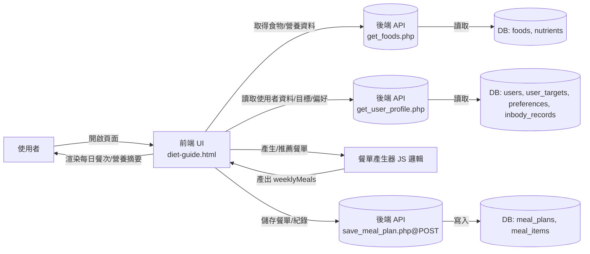
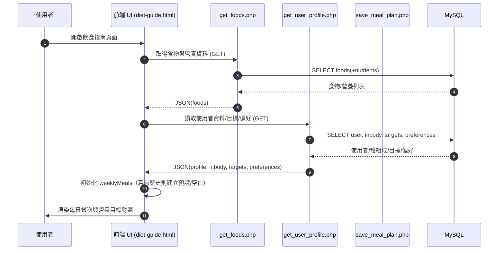
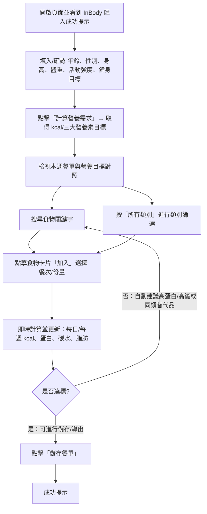
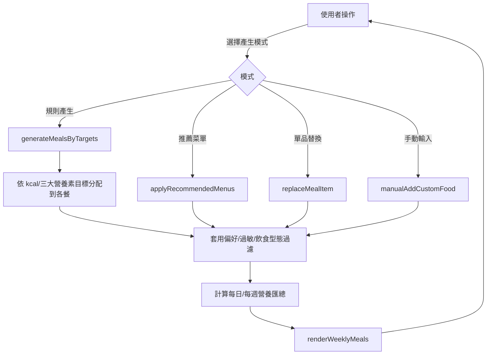
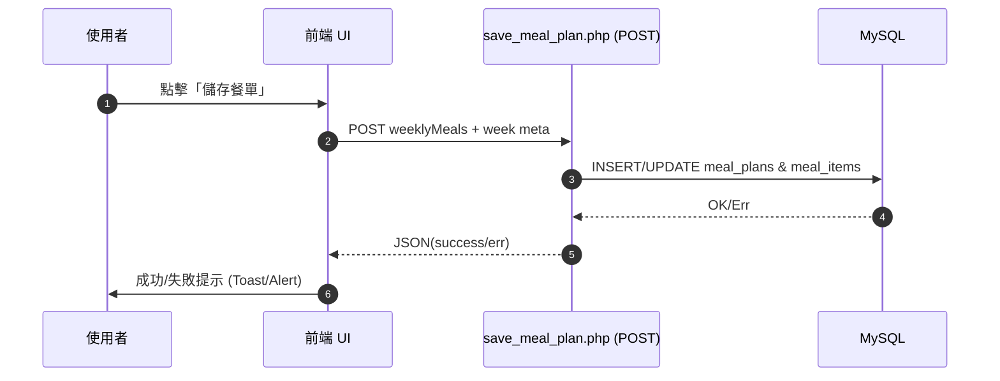

# 飲食指南系統流程圖（Flow & Sequence）

> 本文件描述「飲食指南」模組的整體流程、資料流向與前後端互動序列。採用 Mermaid 繪圖語法，風格與 `training-plan-flow.md` 對齊。

---

## 1. 系統總覽（High‑level Flow）



---

## 2. 資料流與資料模型（Data Flow / Models）

- foods（食物主檔）
  - 核心欄位：`id`, `name`, `brand?`, `serving_size_g`, `kcal`, `protein_g`, `carb_g`, `fat_g`, `sugar_g`, `fiber_g`, `sodium_mg`, `tags[]`
- nutrients（可選：微量營養素）
  - 範例欄位：`vitamin_a_iu`, `vitamin_c_mg`, `calcium_mg`, `iron_mg`, ...
- user_targets（使用者目標）
  - 核心欄位：`user_id`, `kcal_target`, `protein_target_g`, `carb_target_g`, `fat_target_g`, `meals_per_day`, `diet_type`, `allergens[]`, `dislikes[]`
- preferences（使用者偏好/限制）
  - 核心欄位：`user_id`, `budget_level`, `cooking_time_min`, `cuisine`, `avoid_ingredients[]`
- meal_plans（餐單主檔）
  - 核心欄位：`id`, `user_id`, `week_start_date`, `week_number`, `plan_name`, `meals(JSON)`
  - `meals`（weeklyMeals）範例：
    ```json
    {
      "monday": {
        "breakfast": [
          {"foodId": 101, "name": "希臘優格", "serving": 200, "kcal": 130, "protein_g": 20},
          {"foodId": 205, "name": "藍莓", "serving": 80, "kcal": 45}
        ],
        "lunch": [ ... ],
        "dinner": [ ... ],
        "snacks": [ ... ],
        "summary": {"kcal": 1850, "protein_g": 135, "carb_g": 190, "fat_g": 55}
      },
      "tuesday": { ... }
    }
    ```

---

## 3. 頁面載入流程（Page Init）



---

## 3b. 使用者操作流程（User Journey）



---

## 4. 餐單產生（規則/推薦/替換）



補充：
- 規則產生：
  - 以 `meals_per_day` 比例分配 `kcal/protein/carb/fat` 至各餐
  - 來源食物依 `diet_type`、`allergens`、`dislikes`、`avoid_ingredients` 過濾
  - 價格/烹調時間/菜系可作為排序權重
- 推薦菜單：
  - 以預設模組（減脂/增肌/均衡）對齊目標再微調份量
- 單品替換：
  - 維持餐次營養結構，重新挑選同類食物替代並回算份量

---

## 5. 儲存與同步（Save & Sync）



---

## 6. 例外處理（Fallback & Resilience）

- 後端讀取失敗 → 轉為 LocalStorage 備份（`allMealPlans`）
- 營養不達標 → 高蛋白/高纖/低脂的候選清單優先補齊
- 食物不可用/下架 → 自動替換同屬性食物並提示
- 過敏衝突 → 阻止加入並提供替代建議

---

## 7. 主要 API 介面（簡述）

- `GET get_foods.php` → `{ success, data: Food[] }`
- `GET get_user_profile.php` → `{ success, data: { profile, inbody, targets, preferences } }`
- `POST save_meal_plan.php` → `{ success, plan_id? | error? }`

---

> Maintainer: Diet Guide Module  
> File: `dist/diet-guide-flow.md`


