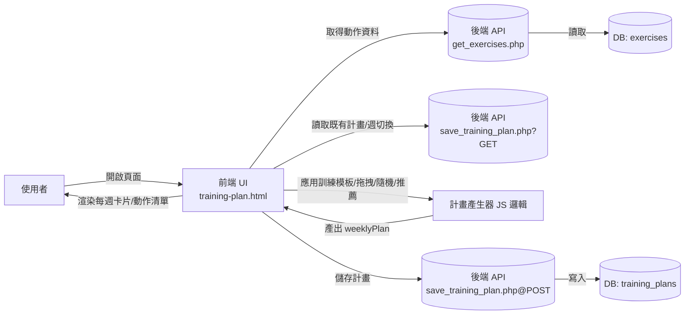
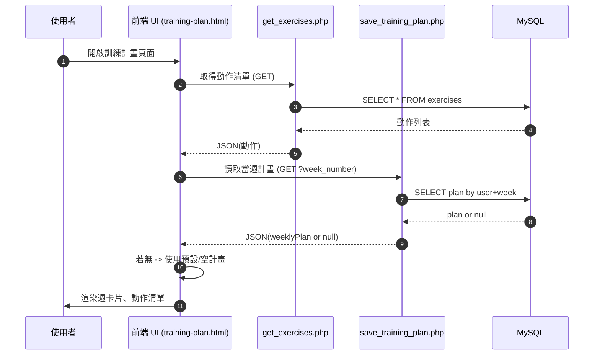
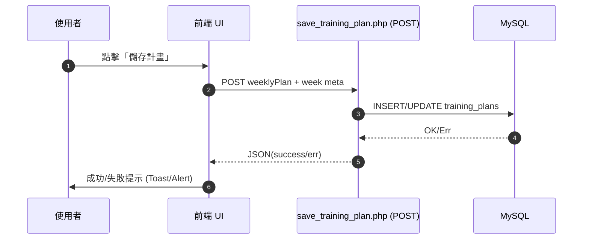

# 訓練計畫系統流程圖（Flow & Sequence）

> 本文件描述「訓練計畫」模組的整體流程、資料流向與前後端互動序列。採用 Mermaid 繪圖語法。

---

## 1. 系統總覽（High‑level Flow）



---

## 2. 資料流與資料模型（Data Flow / Models）

- exercises（動作主檔）
  - 核心欄位：`id`, `name`, `target_muscle`, `description`, `difficulty_level`, `equipment_needed`, ...
- training_plans（訓練計畫）
  - 核心欄位：`id`, `user_id`, `week_start_date`, `week_number`, `plan_name`, `exercises(JSON)`
  - `exercises`（weeklyPlan）範例：
    ```json
    {
      "monday": [
        {"id": 9, "name": "胸推機", "muscleGroup": "中胸", "sets": 3, "reps": 12, "restTime": 60},
        {"id": 1, "name": "上斜啞鈴臥推", "muscleGroup": "上胸", "sets": 3, "reps": 10}
      ],
      "tuesday": [ ... ]
    }
    ```

---

## 3. 頁面載入流程（Page Init）



---

## 4. 產生訓練計畫（模板/隨機/推薦）

```mermaid
flowchart TD
  A[使用者操作]-- 選擇模板卡片 -->B{模式}
  B-- 隨機 -->C[generateUpperLowerSplitRandom]
  B-- 推薦 -->D[applyLevel1ContinuousRecommendations / applyFixedFullbodyRecommendations]
  B-- 拖拽到特定日 -->E[applyTemplateToDay]

  C-->F[肌群映射/關鍵字補捉/新手優先]
  D-->F
  E-->F
  F-->G[填充 weeklyPlan[monday..sunday]]
  G-->H[renderWeeklyPlan]
  H-->A
```

補充：
- 隨機模式：
  - 先依指定肌群篩選動作（不足時做肌群映射，如 背→中背、腹部→核心）
  - 以新手友善/器械/啞鈴優先，避免同日重覆
  - 上半身日保障全胸（上/中/下）、背（上/中）覆蓋，再以肩/手臂補齊 6–8 個
  - 下半身日保障股四/股二/臀/核心，再補齊到 6 個
- 推薦模式：按 Level1 設計或固定清單，直接映射 DB 名稱補齊

---

## 5. 儲存與同步（Save & Sync）



---

## 6. 例外處理（Fallback & Resilience）

- 後端讀取失敗 → 轉為讀取 LocalStorage 備份（`allTrainingPlans`）
- 動作不足 → 肌群映射與名稱關鍵字補捉；上限/下限補齊機制
- 當日/當週重複 → 優先避免同日重複，週內重複由策略視數量放寬

---

## 7. 主要 API 介面（簡述）

- `GET get_exercises.php` → `{ success, data: Exercise[] }`
- `GET save_training_plan.php?week_number=0` → `{ success, data: { weeklyPlan, ... } }`
- `POST save_training_plan.php` → `{ success, plan_id? | error? }`

---

> Maintainer: Training Plan Module  
> File: `dist/training-plan-flow.md`
